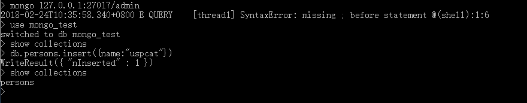
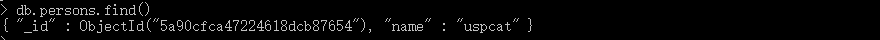
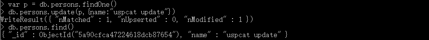
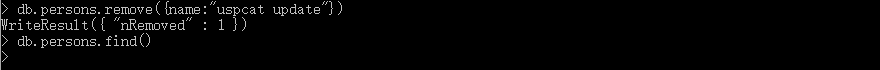

# start-with-mongodb

MongoDB的使用，MongoDB的安装请查看官方文档。

### MongoDB Shell命令行工具基本操作

##### 数据库

1.启动数据库

安装好mongodb后，需要data文件夹存储数据库的数据文件，这里文件夹路径为d:/mognodb/data

	mongod --dbpath d:/mognodb/data

2.连接数据库

mongodb的默认端口是27017；这里连接的数据库为admin

	mongo 127.0.0.1:27017/admin

3.查看所有的数据库

	show dbs

4.创建一个数据库/进入一个数据库

	use [databaseName] 

	例如use mongo_test

但是什么也不做这个空数据库默认会被mongo删除，需要进行数据库增等操作

5.查询所有文档(表)

	show collections

6.删除表

	db.[documentName].drop()

	例如db.persons.drop()

7.删除数据库

	db.dropDatabase()

##### 数据库表：

1.添加数据（添加数据的没有表自动生成表[documentName]和字段）

	db.[documentName].insert({...})

	例如db.persons.insert({name:"uspcat"}) //自动生成id,表中如果没有name字段则自动生成name字段  

  下图中一开始show collections查表为空，insert之后有了表persons  

2.查询数据

	查询所有db.[documentName].find()
	查询第一条数据db.[documentName].findOne()

	例如db.persons.find()

3.更新数据

db.[documentName].update({查询条件},{更新内容})

	//db.persons.update({name:"uspcat"},{$set:{name:"uspcat update"}})

	例如var p = db.persons.findOne()
 	   db.persons.update(p,{name:"uspcat update"})

mongodb的命令行是可以写js语句的。

4.删除数据

	db.[documentName].remove({...})

	例如db.persons.remove({name:"uspcat update"})

删除name:"uspcat update"的地方。

